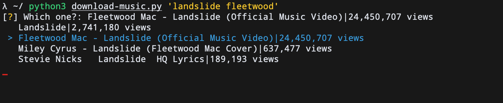
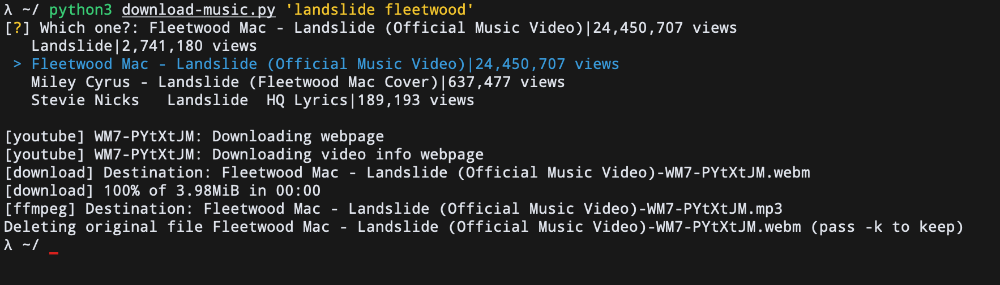

# download-music

For macOS and Linux.

`download-music` is a simple python script to download music from terminal. Only name of the song is required. <br>

This script download music from YouTube and converts it to `.mp3` format.


| Dependencies |
| :------------|
| [ffmpeg](https://ffmpeg.org/download.html)   |
| [BeautifulSoup4](https://www.crummy.com/software/BeautifulSoup/bs4/doc/#problems-after-installation) |
| [youtube-dl](https://github.com/ytdl-org/youtube-dl) |

Clone this repository and use `download-music.py`

## Usage
```bash
python3 download-music.py 'song name'
```
Song is downloaded in the same directory as the execution of the script
### eg.

Select the song you want to download


and that's it !
